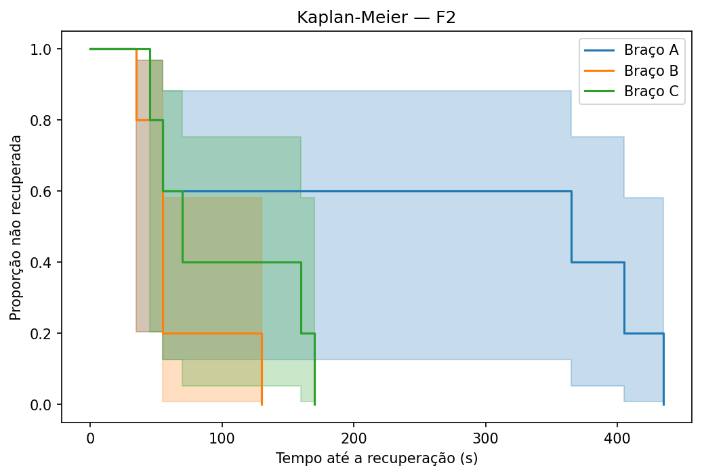
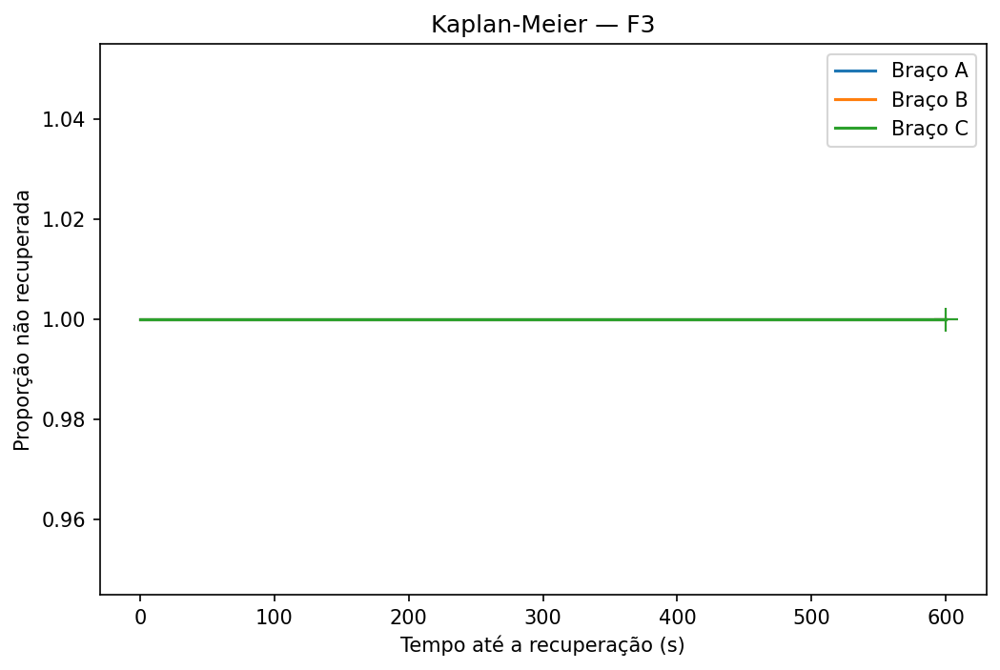
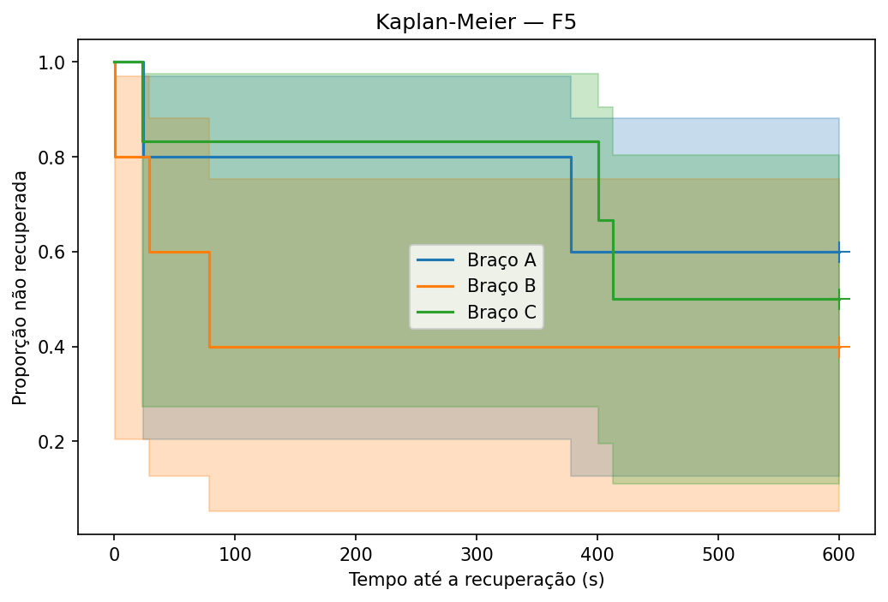

# Resumo da análise da campanha

## H1 — taxa de recuperação e tempo até a recuperação

```
scenario arm  recovered  total  recovery_rate
      F1   A          0      5            0.0
      F1   B          0      5            0.0
      F1   C          0      6            0.0
      F2   A          5      5            1.0
      F2   B          5      5            1.0
      F2   C          5      5            1.0
      F3   A          0      5            0.0
      F3   B          0      4            0.0
      F3   C          0      4            0.0
      F5   A          2      5            0.4
      F5   B          3      5            0.6
      F5   C          3      6            0.5
```

### F1


Log-rank (tempo até a recuperação, primário):
- overall_p_value: p=1.0000
- A_vs_B_p_value: p=1.0000
- A_vs_C_p_value: p=1.0000
- B_vs_C_p_value: p=1.0000

Fisher exato (taxa de recuperação na janela, secundário):
- A_vs_B_p_value: p=1.0000
- A_vs_C_p_value: p=1.0000
- B_vs_C_p_value: p=1.0000

### F2


Log-rank (tempo até a recuperação, primário):
- overall_p_value: p=0.1020
- A_vs_B_p_value: p=0.1106
- A_vs_C_p_value: p=0.1564
- B_vs_C_p_value: p=0.2259

Fisher exato (taxa de recuperação na janela, secundário):
- A_vs_B_p_value: p=1.0000
- A_vs_C_p_value: p=1.0000
- B_vs_C_p_value: p=1.0000

### F3


Log-rank (tempo até a recuperação, primário):
- overall_p_value: p=1.0000
- A_vs_B_p_value: p=1.0000
- A_vs_C_p_value: p=1.0000
- B_vs_C_p_value: p=1.0000

Fisher exato (taxa de recuperação na janela, secundário):
- A_vs_B_p_value: p=1.0000
- A_vs_C_p_value: p=1.0000
- B_vs_C_p_value: p=1.0000

### F5


Log-rank (tempo até a recuperação, primário):
- overall_p_value: p=0.7181
- A_vs_B_p_value: p=0.4713
- A_vs_C_p_value: p=0.8547
- B_vs_C_p_value: p=0.5495

Fisher exato (taxa de recuperação na janela, secundário):
- A_vs_B_p_value: p=1.0000
- A_vs_C_p_value: p=1.0000
- B_vs_C_p_value: p=1.0000

## H2 — recálculo pareado (LLM x RuleEngine, braço B)

- Pares: 295
- Concordância bruta LLM x RuleEngine: 0.4136
- McNemar: estatística=42.0000, p=0.7493
- Tabela: ambos certos=34, só LLM certo=42, só regra certa=46, ambos errados=173

## Taxa de ação esperada e taxa de ação eficaz (ITT x por protocolo)

"Por protocolo" no braço B restringe às decisões sem nenhum FailureReason do LLM registrado (LlmTrace.FailureReasons vazio) — DecidedBy sozinho não serve de filtro porque também vale Fallback quando o RuleEngine do braço C rejeita a própria ação candidata, sem nenhuma falha de LLM envolvida.

Ação esperada (decisão bate com a ação de referência do cenário):
```
braco     protocolo  acertos  total     taxa  ic95_low  ic95_high
    A           ITT      111    385 0.288312  0.245331   0.335475
    B           ITT       76    295 0.257627  0.211062   0.310424
    B por_protocolo       66    251 0.262948  0.212353   0.320690
    C           ITT      112    365 0.306849  0.261752   0.355970
```

Ação eficaz (SLO restaurado ÷ ações executadas — Succeeded/PartiallyApplied/Failed, exclui Rejected):
```
braco     protocolo  restauradas  executadas     taxa  ic95_low  ic95_high
    A           ITT            2           3 0.666667  0.207660   0.938508
    B           ITT           38         121 0.314050  0.238154   0.401389
    B por_protocolo           35         111 0.315315  0.236289   0.406697
    C           ITT           43          72 0.597222  0.481807   0.702789
```

## Taxa de fallback do LLM decomposta por motivo (braço B)

```
               motivo  ocorrencias  pct_das_decisoes_b
PreconditionViolation           23            0.077966
              Timeout           20            0.067797
 PromptBudgetExceeded            4            0.013559
```

## Latência do loop, decomposta em quatro etapas (mediana + IC 95%, ms)

A etapa de correlação inclui a janela de 60s da Fase 7 por desenho — é latência de projeto, não ineficiência do laço (Master Plan §3).

```
        etapa  mediana_ms   ic95_low  ic95_high    n
  deteccao_ms    4991.214  4990.7430   4991.859 1045
correlacao_ms   65052.530 65049.3130  65056.762 1045
   decisao_ms       8.732     8.3960      9.161 1045
   atuacao_ms       6.114     5.9565      6.300  660
```

Etapa de decisão por braço — a mediana acima é pooled entre A/B/C, e A+C (RuleEngine quase instantâneo) são a maioria das linhas; a diferença real só aparece separando por braço:
```
braco  mediana_ms  ic95_low  ic95_high   n
    A       7.509     7.142    7.77200 385
    B    7070.454  6816.717 7375.75400 295
    C       7.603     7.332    7.83295 365
```

## MTTD — tempo até a detecção (mediana + IC 95%, segundos)

```
scenario  mttd_mediana_s  ic95_low  ic95_high  n
      F1        4.659273  2.671564  11.671442 15
      F2        7.043286  4.142723   8.668369 15
      F3        1.668903  0.933979   3.166714 12
      F5       12.793816  7.731426  17.958740 15
   geral        5.674447  3.672798  10.506601 57
```

## Overhead do Norn

Não mensurável nesta campanha: a métrica exige CPU/memória dos Pods do Norn via cAdvisor do kubelet (Master Plan §3), mas Norn.Worker/Norn.API rodaram como processos no host (`dotnet run`) durante toda a campanha real, não como Pods no cluster — decisão operacional registrada desde a Fase 9/10/11, nunca revertida. Não há série de cAdvisor para o Norn neste dataset. Medir isso exigiria rodar a campanha (ou parte dela) com os manifestos `norn-platform.yaml`/`norn-api.yaml` já empacotados, mas nunca ligados ao `bootstrap.ps1`.
